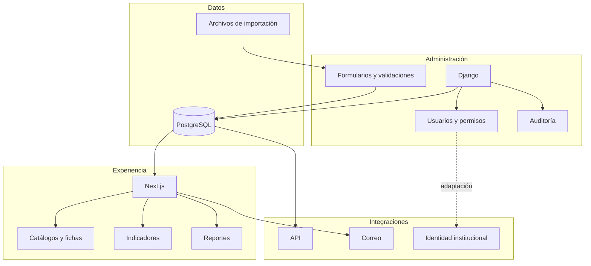

# Arquitectura

**Credencial profesional:** Data Scientist · Responsable de base de datos  
**Créditos de la implementación:** consulta [Créditos y contribuciones](../CREDITOS.md)

## Principios

- Separar el ingreso y la administración de la experiencia de consulta.
- Mantener credenciales y operaciones sensibles en el servidor.
- Centralizar los datos maestros en una fuente transaccional.
- Exponer contratos estables entre componentes.
- Configurar las reglas institucionales sin duplicar el producto.
- Registrar cambios relevantes para asegurar trazabilidad.

## Componentes



## Flujo principal

1. El usuario autorizado ingresa o actualiza información.
2. El backend valida campos, relaciones y permisos.
3. Los cambios se almacenan y quedan disponibles para auditoría.
4. El portal consulta datos autorizados y construye fichas e indicadores.
5. Las integraciones consumen contratos controlados, no tablas internas.

## Configuración por cliente

Una implementación reutilizable debe separar:

```text
Núcleo del producto
├── autenticación y autorización
├── formularios configurables
├── catálogos y relaciones
├── auditoría
├── indicadores
├── reportes
└── API

Configuración del cliente
├── identidad visual
├── entidades y campos
├── perfiles y permisos
├── flujos y estados
├── indicadores y metas
├── plantillas
└── integraciones
```

## Despliegue

La arquitectura admite alternativas administradas o infraestructura del cliente. La selección depende de residencia de datos, presupuesto, integraciones, continuidad operacional y requisitos de seguridad.
